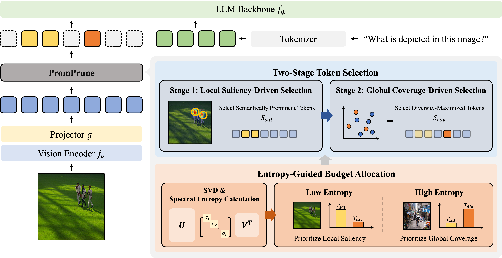

# PromPrune

Official implementation of

**Balancing Saliency and Coverage: Semantic Prominence-Aware Budgeting for Visual Token Compression in VLMs**

Jaehoon Lee, Mingi Jung, Soohyuk Jang, Seungryong Yoo, Dahuin Jung<sup>&dagger;</sup>, Sungroh Yoon<sup>&dagger;</sup>

<sup>&dagger;</sup> Corresponding authors

📄 **Paper** *(coming soon on arXiv)*
💻 **Code:** [https://github.com/jayaylee/PromPrune](https://github.com/jayaylee/PromPrune)

---

## News

- **[2026/03]** 🚀 Our project page is now available.
- 💻 Evaluation code for **LLaVA-NeXT** and **Qwen2.5-VL** will be released soon.

# Overview



**Figure:** Overview of PromPrune. Spectral entropy estimates the semantic prominence distribution of visual tokens and adaptively allocates token budgets between saliency-driven and coverage-driven selection.

Large Vision-Language Models (VLMs) process high-resolution visual inputs that generate **long visual token sequences**, which significantly increase inference cost (attention computation, KV cache memory, and prefill latency).

**PromPrune** is a visual token compression framework designed to **adaptively balance two complementary objectives**:

* **Local saliency preservation**
  Retaining tokens that capture the most semantically important regions.

* **Global coverage preservation**
  Selecting diverse tokens to represent broader visual context.

Our key observation is that the **distribution of semantic prominence varies across images**, implying that the optimal balance between saliency and coverage should **adapt per sample**.

PromPrune therefore introduces:

1. **Semantic Prominence-Aware Budget Allocation**
2. **Two-Stage Token Selection**

This design enables **adaptive visual token compression without modifying the underlying LLM architecture**.

---

# Method

PromPrune operates in two stages.

## 1. Semantic Prominence-Aware Budget Allocation

We estimate the **distribution of semantic prominence** in visual tokens using **spectral entropy**.

The total token budget `T` is decomposed into

```
T = T_sal + T_cov
```

where

* `T_sal` : tokens for salient regions
* `T_cov` : tokens for global coverage

A sigmoidal mapping converts normalized spectral entropy into an adaptive allocation ratio.

Low entropy → concentrated semantics → more saliency tokens
High entropy → distributed semantics → more coverage tokens

---

## 2. Two-Stage Token Selection

### Stage 1 — Saliency-driven selection

Select the top `T_sal` tokens using attention-based saliency scores derived from CLS-to-token attention.

### Stage 2 — Coverage-driven selection

Select `T_cov` tokens from the remaining candidates using a diversity objective.

We use a **Determinantal Point Process (DPP)** style greedy MAP inference to encourage **globally diverse token representations**.

The final compressed token set is

```
E_v = S_sal ∪ S_cov
```

---

# Qualitative Visualization

We visualize the visual tokens selected by different strategies under a fixed token budget.

PromPrune adaptively balances **saliency-driven tokens** and **coverage-driven tokens**, resulting in a more representative token set compared to single-stage strategies.

Red tokens denote **saliency-driven selections**, while cyan tokens denote **coverage-driven selections**.


---

# Repository Structure

```
PromPrune/
│
├── llava/          # LLaVA-based model implementation
├── lmms-eval/      # evaluation framework
├── scripts/        # experiment scripts
│
├── README.md
└── LICENSE
```

PromPrune is implemented as a **visual token compression module integrated into LLaVA-style models**.

The main pruning path is implemented in

```
encode_images_promprune(...)
```

inside the modified LLaVA pipeline.

---

# Installation

Clone the repository

```bash
git clone https://github.com/jayaylee/PromPrune.git
cd PromPrune
```

Create environment

```bash
conda create -n promprune python=3.10 -y
conda activate promprune
```

Install dependencies

```bash
cd lmms-eval
pip install -e .
cd ..
pip install -e .
```

---

# Evaluation

PromPrune is evaluated using **lmms-eval**.

Example command:

```bash
bash eval_promprune.sh
```

Override PromPrune hyperparameters:

```bash
VISUAL_TOKEN_NUM=64 \
PROMPRUNE_KR_MIN=0.0 \
PROMPRUNE_KR_MAX=1.0 \
PROMPRUNE_MU=0.42 \
PROMPRUNE_TAU=0.02 \
bash eval_promprune.sh --tasks mme
```

### Key Parameters

| Parameter        | Description                       |
| ---------------- | --------------------------------- |
| VISUAL_TOKEN_NUM | Target number of visual tokens    |
| PROMPRUNE_KR_MIN | Minimum saliency allocation ratio |
| PROMPRUNE_KR_MAX | Maximum saliency allocation ratio |
| PROMPRUNE_MU     | Entropy midpoint                  |
| PROMPRUNE_TAU    | Sigmoid smoothness                |

---

# Acknowledgements

This project builds upon several open-source frameworks:

* [https://github.com/haotian-liu/LLaVA](https://github.com/haotian-liu/LLaVA)
* [https://github.com/EvolvingLMMs-Lab/lmms-eval](https://github.com/EvolvingLMMs-Lab/lmms-eval)
* [https://github.com/laming-chen/fast-map-dpp](https://github.com/laming-chen/fast-map-dpp)

We thank the authors and maintainers of these projects.

---

# License

This project is licensed under the **Apache License 2.0**.

---

# Contact

For questions or collaboration, please open an issue:

[https://github.com/jayaylee/PromPrune/issues](https://github.com/jayaylee/PromPrune/issues)

---

⭐ **If you find this repository helpful, please consider giving it a star!**
